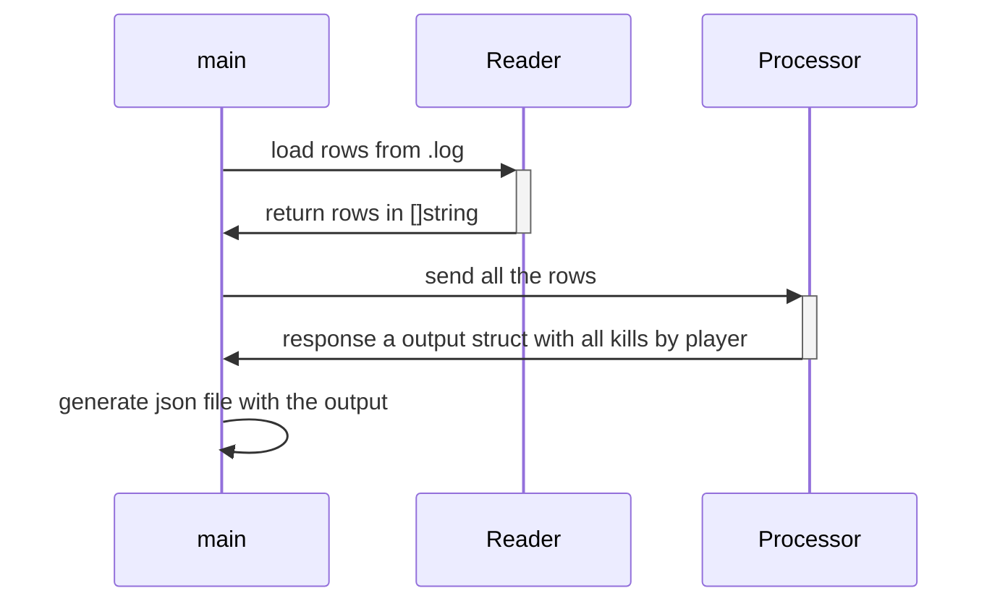

# Quake log Compiler

There is a simple project ro read a .log quake file, ant generate a output json

## Why compiler?

First because compiler is a cool name and translate a .log file into a .json file similar a compiler do with a source code to binary code

## Diagram

## Code Design

I made this design of code to separate reader from processor because i want to make processor agnostic of a file, for example, if we receive a excel file instead a .log file, I only change the reader file and not the processor.
But if the content of this file changes, we need to change the processor

## Run

`go run cmd/cli/main.go`

## Test

`go test -coverprofile=coverage.out ./... ; go tool cover -html=coverage.out`
